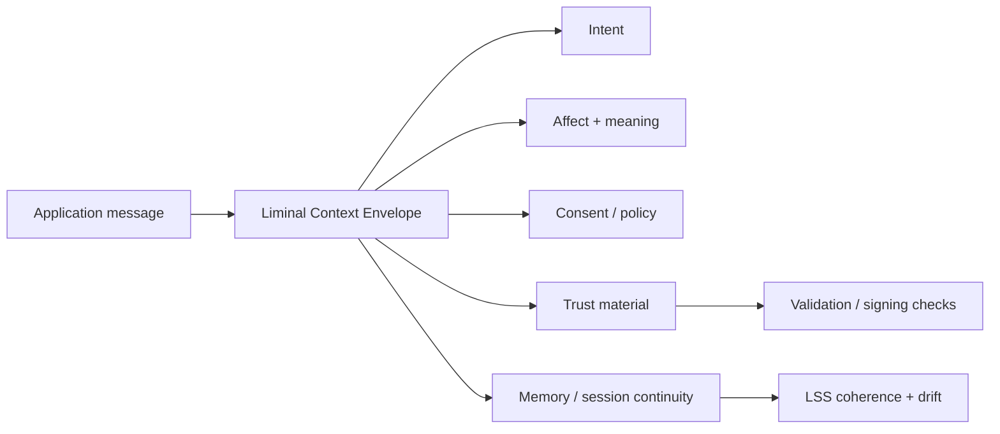

# Grant Evidence Package

Status: reviewer-facing evidence package.

Scope: this document summarizes the current LPI artifact, reproducible reviewer path, evidence assets, explicit non-claims, and near-term roadmap for grant reviewers and technical evaluators.

## One-sentence claim

LPI is a semantic communication and interface-control layer for human-AI systems: it wraps messages with structured intent, affect, consent, trust, memory, and session-coherence metadata so context and boundaries can remain attached across turns and transports.

## Core idea

Ordinary messages usually preserve only content.

LPI preserves the communication state around the content:

```text
message -> context envelope -> intent / affect / consent / trust / memory / session continuity
```

The goal is not to make the model smarter. The goal is to make the interaction state more explicit, portable, and inspectable.

## Why this matters

Output-only interfaces hide important control signals.

A message can be syntactically valid while still being unsafe, underspecified, out of context, or detached from user consent.

LPI makes these interface conditions explicit:

- What is the message trying to do?
- What semantic/affective context surrounds it?
- What consent or sharing expectations apply?
- What trust material or signature is attached?
- What session/thread continuity should be preserved?
- Is the interaction drifting semantically across turns?
- Did transport boundaries preserve context correctly?

## Reviewer path

Fast validation path:

```bash
python scripts/validate_project.py
node --test tests/vocab.artifacts.test.mjs
```

Regenerate validation snapshot:

```bash
python scripts/generate_validation_results.py
```

Python package tests:

```bash
cd packages/python-lri
python -m pytest -q tests/test_lri.py tests/test_lss.py tests/test_validator.py
```

Review key artifacts:

```text
docs/specs/
docs/specs/lhs.md
docs/specs/ltp.md
docs/specs/lss.md
docs/specs/transports.md
docs/security/THREAT-MODEL.md
docs/safety/agentic_presence_threat_model.md
VALIDATION_RESULTS.md
vocab/
schemas/
packages/python-lri/
packages/node-lri/
packages/lpictl/
packages/lrictl/
```

## Architecture at a glance



The important boundary:

```text
LPI preserves and validates communication context.
LPI does not decide the full safety policy of the system by itself.
```

## Current evidence matrix

| Evidence asset | Reviewer question | Path / command | Current status |
| --- | --- | --- | --- |
| README positioning | Is the role clear? | `README.md` | Documented |
| Specs | Are protocol building blocks documented? | `docs/specs/` | Documented |
| LHS spec | Is handshake/session establishment described? | `docs/specs/lhs.md` | Documented |
| LTP spec | Is trust/signing material described? | `docs/specs/ltp.md` | Documented |
| LSS spec | Is session coherence/drift described? | `docs/specs/lss.md` | Documented |
| Transport notes | Are boundary/transport concerns documented? | `docs/specs/transports.md` | Documented |
| Security model | Are threat classes represented? | `docs/security/THREAT-MODEL.md` | Documented |
| Safety framing | Is agentic presence risk framed? | `docs/safety/agentic_presence_threat_model.md` | Documented |
| Validation snapshot | Is a reproducible review surface tracked? | `VALIDATION_RESULTS.md` | Documented |
| Project validator | Can reviewers validate repo status locally? | `python scripts/validate_project.py` | Implemented |
| Vocabulary tests | Are vocab artifacts testable? | `node --test tests/vocab.artifacts.test.mjs` | Implemented |
| Python SDK tests | Are parsing/validation/LSS paths tested? | `packages/python-lri/tests/` | Implemented |
| Node SDK/middleware | Is there a Node integration surface? | `packages/node-lri/` | Implemented |
| CLI tooling | Are command-line tools present? | `packages/lpictl`, `packages/lrictl` | Implemented |

## What is already implemented

- Liminal Context Envelope framing.
- Liminal Handshake Sequence semantics.
- Liminal Trust Protocol / signing semantics.
- Liminal Session Store concepts for continuity, coherence, and drift.
- Python SDK and FastAPI-facing integration.
- Node.js SDK and Express-facing middleware.
- CLI tooling.
- Canonical vocab and schema artifacts.
- Express, FastAPI, WebSocket, and signing examples.
- Security threat model.
- Agentic presence safety threat model.
- Reproducible validation script and validation snapshot.

## Core design principles

LPI is organized around interface-control principles:

```text
Do not separate message content from consent context.
Do not silently lose intent across transport boundaries.
Do not treat trust material as out-of-band if it affects interpretation.
Do not ignore session drift when meaning changes over turns.
Do not make semantic context purely narrative when it can be structured.
```

These principles make LPI different from a generic messaging wrapper.

## What LPI makes inspectable

LPI is designed to make communication context inspectable, including:

- the stated intent of a message,
- affective and semantic context,
- consent and sharing expectations,
- trust/signature material,
- memory references and session continuity,
- coherence and drift across a thread,
- whether handshakes preserve context across transports,
- whether downstream services still receive the context needed to interpret the message safely.

## Relationship to the Liminal Evidence Stack

LPI is the semantic interface-control layer.

- **LPI:** carries intent, affect, consent, trust, memory, and session-coherence metadata across communication boundaries.
- **LRI:** governs living relational identity and identity continuity boundaries.
- **DRP:** records structured decisions and supersession.
- **DMP:** preserves consequence memory and reversibility drift.
- **PythiaLabs:** gates high-risk proposed actions before execution.
- **CaPU:** controls whether actions may progress to side effects.
- **T-Trace:** records machine-checkable transition traces.
- **LTP:** provides replay/admissibility/oversight surfaces in the evidence stack.
- **CML/vCML:** audits causal and authorization lineage.
- **TTM DB / LiminalDB:** preserve trace/evidence substrates and derived views.

Short version:

```text
LPI keeps interaction context attached.
DRP/DMP preserve decision and consequence memory.
T-Trace/LTP preserve trace/replay evidence.
CML audits causal validity.
CaPU controls side effects.
```

## What this project does not claim yet

LPI currently does not claim:

- to solve all AI safety problems,
- to determine correct policy by itself,
- to guarantee consent validity in every social/legal context,
- to replace authentication, authorization, or identity governance systems,
- to replace LRI for identity continuity governance,
- to replace DRP/DMP for decision/consequence memory,
- to replace CML for causal lineage audit,
- to provide production compliance certification by itself,
- to prove semantic truth of all envelope fields.

The narrower claim is stronger:

```text
LPI provides structured communication envelopes and validation surfaces for preserving intent, consent, trust, memory, and session coherence across human-AI interaction boundaries.
```

## Why this is grant-relevant

Agentic AI systems increasingly act across tools, services, transports, and long-running sessions.

Oversight becomes weaker when important context is lost between boundaries.

LPI contributes one safety primitive:

```text
message content + structured context envelope -> inspectable interaction state
```

This supports research into consent-aware interfaces, agentic oversight, semantic drift detection, context-preserving handoffs, signed envelopes, and long-running human-AI communication.

## Research / build roadmap

Near-term work can focus on:

1. **Reviewer report output** — generate a compact report showing validation status, vocab artifacts, and package test coverage.
2. **LPI/LRI boundary doc** — clarify semantic interface context vs living identity governance.
3. **LPI/DRP bridge** — document how consent/context state can be referenced by decision records.
4. **LPI/CaPU bridge** — document how LPI envelopes can provide context for side-effect permission checks.
5. **LPI/T-Trace bridge** — map interface events into trace records without making T-Trace own semantics.
6. **Drift examples** — add more examples where LSS detects session/context drift.
7. **Consent examples** — expand examples for consent-carrying policy fields and safe handoff boundaries.

## Suggested reviewer checklist

A reviewer can ask:

- Can I run the fast validation path locally?
- Are specs and package surfaces documented?
- Are consent/trust/session concepts represented explicitly?
- Are security and safety threat models present?
- Is LPI clearly distinct from LRI, DRP/DMP, CML, and runtime enforcement layers?
- Are non-claims explicit?
- Is the safety failure class concrete?

## Current strongest positioning

Use this formulation in applications:

```text
LPI is a semantic communication and interface-control protocol for human-AI systems. It wraps messages with structured intent, affect, consent, trust, memory, and session-coherence metadata so agentic systems can preserve and inspect interaction context across turns, tools, and transports.
```

## Short version

```text
LPI keeps interaction context attached.
```
