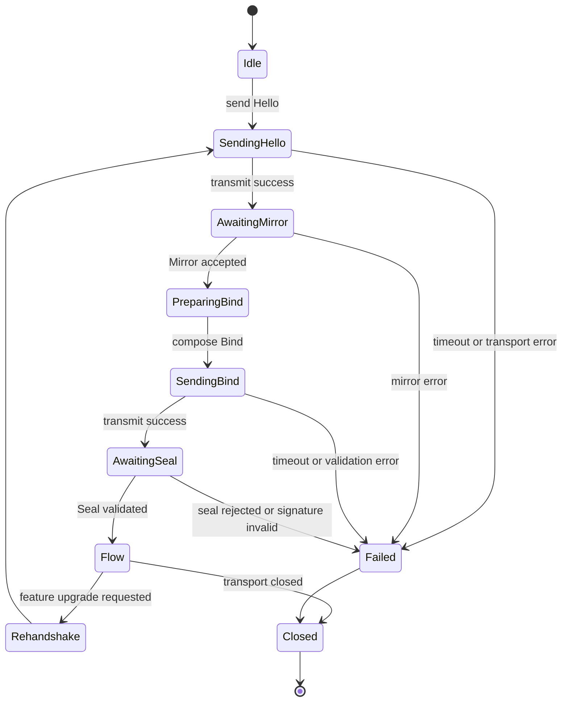
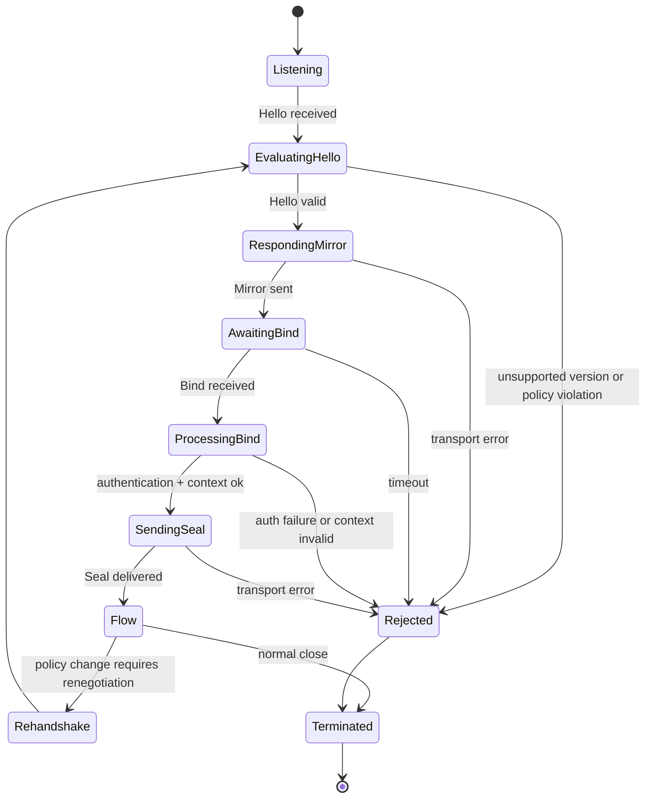

# LHS-001: Liminal Handshake Sequence (Hello → Mirror → Bind → Seal → Flow)

**Status:** Draft  
**Author(s):** LRI Protocol Working Group  
**Created:** 2025-01-20  
**Updated:** 2025-01-20  
**Version:** 0.1.0

---

## Table of Contents

- [Abstract](#abstract)
- [1. Purpose and Scope](#1-purpose-and-scope)
- [2. Sequence Overview](#2-sequence-overview)
  - [2.1 Roles](#21-roles)
  - [2.2 Message Envelope](#22-message-envelope)
- [3. Step Narratives](#3-step-narratives)
  - [3.1 Hello](#31-hello)
  - [3.2 Mirror](#32-mirror)
  - [3.3 Bind](#33-bind)
  - [3.4 Seal](#34-seal)
  - [3.5 Flow](#35-flow)
- [4. State Machines](#4-state-machines)
  - [4.1 Client State Machine](#41-client-state-machine)
  - [4.2 Server State Machine](#42-server-state-machine)
- [5. Transport Bindings](#5-transport-bindings)
  - [5.1 HTTP Negotiation Headers](#51-http-negotiation-headers)
  - [5.2 WebSocket First Frames](#52-websocket-first-frames)
- [6. Failure Handling](#6-failure-handling)
- [7. Security Considerations](#7-security-considerations)
- [8. References and Examples](#8-references-and-examples)

---

## Abstract

The **Liminal Handshake Sequence (LHS)** establishes mutual capability awareness between LRI-aware clients and servers before any semantic payload is exchanged. Each step refines the shared context, negotiates features, and produces a sealed session that transitions into sustained **Flow** of LCE (Liminal Context Envelope) messages. This document narrates each step and defines normative state-machine transitions for implementations.

---

## 1. Purpose and Scope

1. Define the ordered steps (**Hello → Mirror → Bind → Seal → Flow**) that precede LCE exchange.
2. Describe required and optional fields for each message.
3. Provide canonical state machines for clients and servers.
4. Specify transport bindings for HTTP headers and WebSocket frames.
5. Outline failure handling and security expectations for interoperable agents.

This specification does **not** redefine LCE structure, cryptography primitives, or application-specific payloads.

---

## 2. Sequence Overview

The handshake is a four-message negotiation followed by a steady-state flow. Hello and Bind originate from the client; Mirror and Seal originate from the server.

```text
Client                                       Server
  │                                             │
  │  1. Hello (capabilities, preferences)       │
  ├────────────────────────────────────────────►│
  │                                             │
  │  2. Mirror (negotiated view)                │
  │◄────────────────────────────────────────────┤
  │                                             │
  │  3. Bind (session context & auth)           │
  ├────────────────────────────────────────────►│
  │                                             │
  │  4. Seal (session commitment)               │
  │◄────────────────────────────────────────────┤
  │                                             │
  │  5. Flow (bidirectional LCE exchange)       │
  │◄══════════════════════════════════════════►│
```

### 2.1 Roles

| Role | Responsibility |
|------|----------------|
| **Initiator (Client)** | Starts Hello, supplies Bind, validates Seal, and begins Flow after confirmation. |
| **Responder (Server)** | Mirrors negotiated options, validates Bind, issues Seal, and enforces policies during Flow. |

### 2.2 Message Envelope

All LHS messages share a JSON envelope with a `step` discriminator. Additional fields vary per step and are listed in [Section 3](#3-step-narratives).

```json
{
  "step": "hello",
  "…": "…"
}
```

Identifiers (`client_id`, `server_id`, `session_id`, `thread`) are opaque strings. Feature flags reference the capability names defined in [RFC-000](../rfcs/rfc-000.md).

---

## 3. Step Narratives

Each subsection below is normative unless otherwise stated. Implementations MUST emit and accept lowercase `step` identifiers.

### 3.1 Hello

**Purpose:** Initiate the handshake and advertise client-side capabilities.

**Payload Fields:**

| Field | Type | Required | Description |
|-------|------|----------|-------------|
| `step` | string | ✅ | Literal value `"hello"`. |
| `lri_version` | string | ✅ | Highest protocol version supported by the client. |
| `encodings` | array | ✅ | Ordered preference list of payload encodings (e.g., `"json"`, `"cbor"`). |
| `features` | array | ✅ | Requested optional features such as `"ltp"`, `"lss"`, `"compression"`. |
| `client_id` | string | ⚠️ | Optional stable identifier for session analytics or resumption. |

**Narrative:** The client composes Hello with the maximum LRI version and capability wishlist. Servers SHOULD preserve ordering to honor client preference. Unknown feature names MUST be ignored rather than rejected.

**Validation:**

- Reject if `lri_version` is unsupported.
- Reject if `encodings` is empty.
- Reject if payload exceeds negotiated size limits (default 4 KB).

**Transition:** Successful Hello transitions the client to `AwaitingMirror` and the server to `EvaluatingHello`.

**Example:**

```json
{
  "step": "hello",
  "lri_version": "0.2",
  "encodings": ["json", "cbor"],
  "features": ["ltp", "lss"],
  "client_id": "agent-458"
}
```

### 3.2 Mirror

**Purpose:** Echo client intent, constrain the negotiated surface, and provide server identity hints.

**Payload Fields:**

| Field | Type | Required | Description |
|-------|------|----------|-------------|
| `step` | string | ✅ | Literal `"mirror"`. |
| `lri_version` | string | ✅ | Version chosen by the server (≤ client proposal). |
| `encoding` | string | ✅ | Single encoding selected from the client's list. |
| `features` | array | ✅ | Granted features (subset of client request). |
| `session_window` | number | ⚠️ | Optional handshake TTL (seconds) before Flow must start. |
| `server_id` | string | ⚠️ | Optional server identifier for auditing. |

**Narrative:** Mirror confirms the negotiated protocol surface. Clients MUST respect the returned encoding and feature subset. When `session_window` is provided, the client must begin Flow before expiry or restart negotiation.

**Transition:** Client moves to `PreparingBind`; server advances to `AwaitingBind`.

**Example:**

```json
{
  "step": "mirror",
  "lri_version": "0.2",
  "encoding": "json",
  "features": ["ltp"],
  "session_window": 300,
  "server_id": "gateway-nyc"
}
```

### 3.3 Bind

**Purpose:** Provide session context, authentication material, and any negotiation metadata required by the responder.

**Payload Fields:**

| Field | Type | Required | Description |
|-------|------|----------|-------------|
| `step` | string | ✅ | Literal `"bind"`. |
| `thread` | string | ⚠️ | Client-selected thread identifier for LCE continuity. |
| `auth` | string | ⚠️ | Bearer token or credential reference; semantics defined by deployment. |
| `metadata` | object | ⚠️ | Arbitrary key/value pairs relevant to session initialization. |

**Narrative:** Bind attaches all contextual state necessary for the server to allocate resources. Servers MUST treat unknown keys in `metadata` as opaque. Authentication failures at this step terminate the handshake with an explicit error.

**Transition:** Client enters `AwaitingSeal`; server processes Bind and either issues Seal or aborts with an error.

**Example:**

```json
{
  "step": "bind",
  "thread": "550e8400-e29b-41d4-a716-446655440000",
  "auth": "Bearer eyJhbGciOiJFZERTQSIsInR5cCI6IkpXVCJ9...",
  "metadata": {
    "locale": "en-US",
    "timezone": "America/New_York"
  }
}
```

### 3.4 Seal

**Purpose:** Finalize the negotiated session, bind it to cryptographic attestation, and communicate expiry constraints.

**Payload Fields:**

| Field | Type | Required | Description |
|-------|------|----------|-------------|
| `step` | string | ✅ | Literal `"seal"`. |
| `session_id` | string | ✅ | Authoritative session identifier assigned by the server. |
| `sig` | string | ⚠️ | Optional detached JWS signature over the concatenated Hello+Bind transcript. |
| `expires` | string | ⚠️ | ISO-8601 timestamp after which the session is invalid. |

**Narrative:** Seal affirms that the server accepts the negotiated parameters. When `sig` is present, clients MUST verify the signature before entering Flow. Expired sessions MUST renegotiate.

**Transition:** Both peers enter the `Flow` state upon Seal acceptance. Clients that fail signature verification MUST abort and report the failure.

**Example:**

```json
{
  "step": "seal",
  "session_id": "a1f1f94c-4e9f-4a64-94c5-ccd8d4a82b52",
  "sig": "eyJhbGciOiJFZERTQSJ9..signature",
  "expires": "2025-01-31T12:00:00Z"
}
```

### 3.5 Flow

**Purpose:** Represent the steady-state in which LCE-wrapped payloads are exchanged.

**Narrative:** Flow is not a standalone handshake message; it is the state entered after a valid Seal. Transports MAY emit an optional `flow` acknowledgement carrying the `session_id` (and optionally the negotiated `thread`) for observability, but they MUST NOT introduce new negotiation parameters at this stage. All subsequent communication MUST include LCE metadata according to the negotiated encoding.

**Exit Conditions:**

- Session expiry (`expires` elapsed).
- Feature renegotiation (restart from Hello).
- Transport closure or fatal error.

---

## 4. State Machines

The following diagrams are normative for implementations. Additional transient substates are permitted provided that external behaviors remain equivalent.

### 4.1 Client State Machine



### 4.2 Server State Machine



---

## 5. Transport Bindings

### 5.1 HTTP Negotiation Headers

LHS-over-HTTP uses request/response headers prior to (or alongside) REST or gRPC semantics.

| Header | Direction | Description |
|--------|-----------|-------------|
| `LRI-LHS-Step` | Request & Response | Indicates the handshake step associated with the HTTP message (`hello`, `mirror`, `bind`, `seal`, `flow`). |
| `LRI-LHS` | Request & Response | Base64-encoded JSON envelope for the indicated step. Standard Base64 with padding (`=`) MUST be used. |
| `LCE` | Request & Response | Base64-encoded LCE payload, only present once Flow begins. |

**Usage Notes:**

1. Hello and Bind are typically `POST` requests to a negotiation endpoint (e.g., `/lri/connect`).
2. Mirror and Seal are expressed via HTTP responses bearing the same headers.
3. Flow transitions to application endpoints (`/chat`, `/stream`, etc.) with `LCE` headers and optional `LRI-LHS-Step: flow` to indicate the steady state.
4. Implementations SHOULD persist the negotiated session identifier in application cookies or headers as needed.

A complete HTTP transcript is available at [`examples/lhs/http.json`](../../examples/lhs/http.json).

### 5.2 WebSocket First Frames

For WebSocket transports, the handshake occurs within the first four text frames immediately after the underlying WebSocket connection is established. Flow frames thereafter follow the binary LRI framing defined in [RFC-000](../rfcs/rfc-000.md#10-protocol-subsystems).

| Frame Index | Direction | Content Type | Description |
|-------------|-----------|--------------|-------------|
| 1 | Client → Server | Text | Hello JSON envelope. |
| 2 | Server → Client | Text | Mirror JSON envelope. |
| 3 | Client → Server | Text | Bind JSON envelope. |
| 4 | Server → Client | Text | Seal JSON envelope (optionally signed). |
| ≥5 | Bidirectional | Binary | Length-prefixed LCE + payload frames. |

Clients MUST NOT send binary frames before Seal is acknowledged. Servers MUST close the connection with code `1002` (protocol error) if the ordering is violated.

A fully populated frame trace, including an encoded Flow frame, is provided at [`examples/lhs/ws.json`](../../examples/lhs/ws.json).

---

## 6. Failure Handling

- **Timeouts:** Each handshake step SHOULD have a watchdog (default 5 seconds). On timeout, peers abort with an explicit error (`408` over HTTP, `4401` close code over WebSocket).
- **Version mismatch:** Responders MAY return `426 Upgrade Required` with supported versions in `LRI-LHS` payload.
- **Authentication failure:** Bind rejection MUST specify `reason` and `code` fields in an error payload to aid diagnostics.
- **Signature failure:** Clients MUST terminate the session and optionally restart from Hello; servers SHOULD audit repeated signature failures.

---

## 7. Security Considerations

1. **Integrity:** When `sig` is present in Seal, canonicalize the Hello and Bind payloads (JCS) before verification.
2. **Replay Protection:** Include nonces or timestamps in Bind metadata when using bearer tokens to prevent replay of Bind messages.
3. **Privacy:** Avoid embedding personally identifiable information in cleartext fields; rely on encrypted transports (TLS 1.2+).
4. **Downgrade Resistance:** Compare the negotiated `lri_version` and `features` against policy. Reject Mirror responses that drop mandatory features (e.g., `ltp` when required).
5. **Logging:** Log session identifiers and handshake decisions for audit trails, omitting raw credentials in Bind.

---

## 8. References and Examples

- **Normative:** [RFC-000: The Liminal Resonance Interface — Overview](../rfcs/rfc-000.md)
- **Examples:**
  - [`examples/lhs/http.json`](../../examples/lhs/http.json) — HTTP negotiation using `LRI-LHS-Step` and `LRI-LHS` headers.
  - [`examples/lhs/ws.json`](../../examples/lhs/ws.json) — WebSocket frames covering Hello → Flow.
- **Related Protocols:** LTP (Liminal Trust Protocol), LSS (Liminal Session Store) defined in RFC-000 Section 10.

---

*End of specification.*
